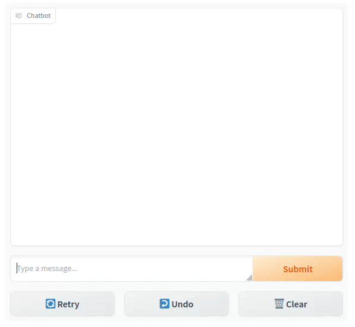

# Simple phi-2 chatbot

This repository contains a simple chatbot using the [microsoft/phi-2](https://huggingface.co/microsoft/phi-2)
large language model.

Here you can see a GIF showcasing a short conversation.

## Quickstart

If you want to quickly run the code, you have three options:

1. The easiest way is to [run `Simple phi-2 chatbot` notebook on colab](https://colab.research.google.com/drive/1dmP7tjWdYjM-mYy_Cg-nKXnUjz-d_UwA?usp=sharing)
2. Download the code and run `simple_phi2_chatbot.ipynb` notebook (you need to install `requirements.txt`)
3. Download the code and run `gradio app.py` (you need to install `requirements.txt`)

> ⚠️ **Warning:** Inference is much fastar on GPU than on CPU.

## How it was done

This chatbot demo was done in the following steps:

### Get familiar with the model
 
The first thing that was done, was to search info about the [`microsoft/phi-2`](https://huggingface.co/microsoft/phi-2) model and start getting familiar with how it performed, it's advantages, issues and flaws.
For that, I experimented with it in a dedicated nottebook (`experiments.ipynb`), have a look at it.
There you can find the first experiments I performed and some of the conclusions I got.

### Search for a chatbot UI in Gradio

[Gradio](https://www.gradio.app/) is a nice way to perform AI demos, such as chatbots.
I searched to sample code to use gradio when building chatbots.
Hopefully, there is a [ChatInterface](https://www.gradio.app/docs/chatinterface) that allows developers to quickly create a chatbot like panel.
Moreover, there is [sample code](https://www.gradio.app/guides/creating-a-chatbot-fast#example-using-a-local-open-source-llm-with-hugging-face) on how to integrate that class with your custom language model.

### Adapt the interface to work with `phi-2`

The original code used a different model (`togethercomputer/RedPajama-INCITE-Chat-3B-v1`), I had to adapt it to work with `phi-2`.
Besides the obvious changes, such as changing the name when loading the _tokenizer_ and _model_, other changes were needed.
Here we showcase just the following:

+ Add some context to the chat (see `CONTEXT` variable) and change chat format.
From `<user>:` to just `User:`.
+ Change the stopping criteria at `StopOnTokens`.
This class needed to be updated to account for the `id` of the `<|endoftext|>` token of the `phi-2` tokenizer.
Additionally, the end of line token `\n` was finally added as well to prevent the model from hallucinating weird text (although this hurts the performance of the model when it wants to output legit multi-line content).
+ Create a new stopping criteria class called `StopOnNames`.
It blocks the model from hallucinating future turns of the conversation as it stops it when it finds a token sequence that represents a new line with the speaker name (e.g. `\nUser:`).
    > ❗ **Note:** This got obsolete after adding the end of line character as a stopping criteria.
    However it was left in the code intentionally in case it's useful for a more refined stopping mechanism.

### Add GPU and CPU support

The sample code from [`microsoft/phi-2` model page](https://huggingface.co/microsoft/phi-2) was using GPU by default.
The code was not working when running on a CPU.
CPU support was added with a `device` variable that stores the device where the model should run, and changing the load parameters depending on that device.

### Add multi language support

As the specifications explain, `phi-2` is an English model:

> Language Limitations: The model is primarily designed to understand standard English. Informal English, slang, or any other languages might pose challenges to its comprehension, leading to potential misinterpretations or errors in response.

However, it is still somehow capable of speaking other languages.
To try that, a `LANG` variable was created (allowed values are `EN` for English, defaul; and `ES` for Spanish).
Setting this variable, we change the language of the `CONTEXT` conditioning and we push the model to speak in that language.
The model performance in Spanish is limited.

### Adapt the code for different run configurations

Finally, the code was adapted to run on different configurations: using gradio command, on a local jupyter notebook or on Google Colab.
Check the [Quickstart](#quickstart) section.